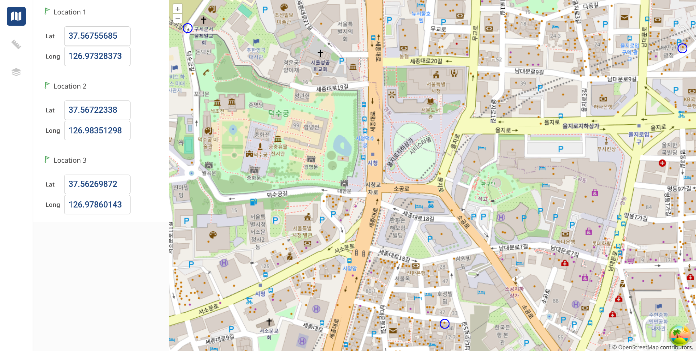

# 🧑🏻‍💻 Angelswing Front-end Test

## Project Overview

### Screenshot


## Technologies

- React.js
- OpenLayers
- Node.js
- React Query
- Styled Components

## Getting Started

### Prerequisites

Before running the application, make sure you have the following installed:

- Node.js

### Installation

1. Clone the repository

```bash
git clone https://github.com/angelswing-recruit/phurba-sherpa-20240308.git
```


2. Go to the project directory and install dependencies for both the client and server

```bash
cd phurba-sherpa-20240308
npm install
```

3. Create a `.env` file in root directory and add the environment variables as shown in the `.env.example` files.

4. Start the web server

```bash
npm run dev
```

### Issues :pushpin:

If you happen to get blank map after the api fetch, then try adjusting zoom, I didn't get why map goes blank if you try to zoom in or zoom out. So, to see the map, please do one of the following steps
- Try using zoom in or zoom out button of the Overlay map.
- Try refreshing the page
- Inspect browser ```CTR + SHIFT + I ```. And may be try resizing the window using responsive dimensions.

